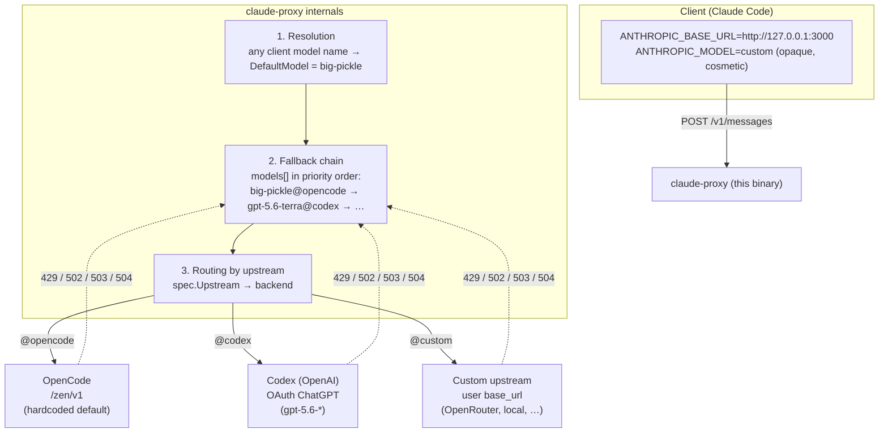

# 🔄 claude-proxy

A lightweight Go proxy that lets [Claude Code](https://docs.anthropic.com/en/docs/claude-code) use free models exposed by [OpenCode](https://opencode.ai), or any OpenAI-compatible API.

[](https://go.dev/)
[](LICENSE)
[](https://hub.docker.com/r/phd59fr/claude-proxy)

## 📝 Description

This proxy translates Anthropic Messages API requests into OpenAI Chat Completions format, enabling Claude Code and other Anthropic clients to use free models or any OpenAI-compatible upstream.

**Key Features:**
- 🔄 **Protocol translation**  - Anthropic Messages API ↔ OpenAI Chat Completions
- 🧬 **OpenAI Codex backend**  - Use ChatGPT Plus/Pro subscription with Codex models
- 🌊 **Full streaming**  - SSE with correct lifecycle ordering
- 🛠️ **Tool/function calling**  - single and parallel tool calls across protocols
- 🔑 **API key passthrough**  - each client authenticates with its own upstream key
- 🧠 **Thinking routing**  - reasoning → powerful model, completions → fast model
- 🔐 **OAuth PKCE flow**  - Built-in `codex-login` command for ChatGPT authentication
- 🔍 **Debug & verbose modes**  - full request/response logging
- 📦 **Zero dependencies**  - Go standard library only
- 🐳 **UPX compressed Docker**  - ~2MB final image (scratch-based)

## 📐 Architecture



**Key points:**
- The model name sent by the client is **opaque**: the proxy always walks its `models[]` list in order.
- Each `models[]` entry carries an `upstream` field that decides which backend receives the request.
- Fallback can **span upstreams** (e.g. `big-pickle` fails on opencode → `gpt-5.6-terra` is sent to codex).
- `opencode` is always present (default); `codex` is used when OAuth is configured; `custom` is whatever you add to `upstreams[]`.

## ⚡ Quick Start

### Option 1  - Docker (recommended)

```bash
# Minimal: nothing to configure — OpenCode is the hardcoded default
docker run --rm -p 127.0.0.1:3000:3000 phd59fr/claude-proxy:latest

# Multi-upstream example (models list with explicit upstreams)
docker run --rm -p 127.0.0.1:3000:3000 \
  -e MODELS='[{"name":"big-pickle","upstream":"opencode"},{"name":"gpt-5.6-terra","upstream":"codex"}]' \
  -e UPSTREAMS='[{"name":"openrouter","base_url":"https://openrouter.ai/api","api_key":"sk-or-..."}]' \
  phd59fr/claude-proxy:latest
```

### Option 2  - From source

```bash
git clone https://github.com/PHD59fr/claude-proxy.git
cd claude-proxy
make build
./claude-proxy serve
```

If a `config.json` exists in the current directory, it's loaded automatically.

### Option 3  - Codex (ChatGPT subscription)

```bash
# Step 1: Authenticate with ChatGPT (opens browser)
./claude-proxy codex-login

# Step 2: Start the proxy
./claude-proxy serve

# Step 3: Use with Claude Code
./scripts/claude-codex.sh gpt-5.6-sol
```

The `codex-login` command:
1. Opens your browser to ChatGPT login
2. Waits for the OAuth callback automatically
3. If auto-callback fails (remote/SSH), you can paste the redirect URL manually
4. Saves tokens to `~/.config/claude-proxy/config.json`

### Connect Claude Code

The banner already shows the exact environment variables to set. Copy them from the banner, or run:

```bash
export ANTHROPIC_BASE_URL="http://127.0.0.1:3000"
export ANTHROPIC_AUTH_TOKEN="unused"
export ANTHROPIC_MODEL="custom"
export CLAUDE_CODE_SUBAGENT_MODEL="custom"
export CLAUDE_CODE_ENABLE_GATEWAY_MODEL_DISCOVERY=1
unset ANTHROPIC_API_KEY
claude --model custom
```

## 🚀 Usage

### 🐳 Docker

```bash
# Build
docker build --build-arg VERSION=1.0.0 -t claude-proxy .

# Run (free OpenCode models — OpenCode is the default, nothing to set)
docker run --rm -p 127.0.0.1:3000:3000 claude-proxy

# Run with OpenRouter as an extra upstream (declare it + wire models to it)
docker run --rm -p 127.0.0.1:3000:3000 \
  -e UPSTREAMS='[{"name":"openrouter","base_url":"https://openrouter.ai/api","api_key":"sk-or-..."}]' \
  -e MODELS='[{"name":"openai/gpt-4o","upstream":"openrouter"},{"name":"big-pickle","upstream":"opencode"}]' \
  -e ALLOW_UNLISTED_MODELS=true \
  claude-proxy

# Run with API key passthrough (each client authenticates itself)
docker run --rm -p 0.0.0.0:3000:3000 \
  -e UPSTREAMS='[{"name":"openrouter","base_url":"https://openrouter.ai/api","api_key":"public"}]' \
  -e UPSTREAM_API_KEY_PASSTHROUGH=true \
  -e ALLOW_UNLISTED_MODELS=true \
  claude-proxy
```

**Docker Hub image:**
```bash
docker run --rm -p 127.0.0.1:3000:3000 phd59fr/claude-proxy:latest
```

### 🐳 Docker Compose

```bash
# Create your local configuration from the safe template.
# Keep credentials only in this ignored local file.
cp config.example.json config.json

# Or create a minimal config.json manually.
cat > config.json << 'EOF'
{
  "models": [
    {"name": "big-pickle", "upstream": "opencode"},
    {"name": "gpt-5.6-terra", "upstream": "codex"},
    {"name": "deepseek-v4-flash-free", "upstream": "opencode"}
  ]
}
EOF

# Login with ChatGPT (tokens saved to config.json)
docker compose run claude-proxy codex-login

# Start the proxy
docker compose up -d
```

The `docker-compose.yml` mounts `./config.json` into the container at `/app/config.json` and auto-detects it. Its healthcheck calls the built-in `claude-proxy healthcheck` command, which works in the production `scratch` image without shell utilities.

## 🧬 Codex (ChatGPT Subscription)

Use your ChatGPT Plus/Pro subscription to access Codex models (GPT-5.x) without an API key.

### Setup

```bash
# 1. Authenticate with ChatGPT (opens browser, waits for callback)
./claude-proxy codex-login

# 2. Configure the models list so Codex models route to the codex backend.
#    The wizard asks for a models list, e.g.:
#      gpt-5.6-sol@codex,gpt-5.4@codex,big-pickle
./claude-proxy config

# 3. Start the proxy
./claude-proxy serve

# 4. Use with Claude Code
./scripts/claude-codex.sh gpt-5.6-sol
```

The login flow:
1. Shows the OAuth URL
2. Tries to open your browser automatically
3. Waits for the callback on `localhost:1455`
4. If auto-callback fails (SSH/remote), paste the redirect URL when prompted

### Available Codex Models

| Model | Description |
|-------|-------------|
| `gpt-5.6-sol` | GPT-5.6 Sol - detail and polish, medium reasoning |
| `gpt-5.6-terra` | GPT-5.6 Terra - everyday workhorse |
| `gpt-5.6-luna` | GPT-5.6 Luna - clear, repeatable work |
| `gpt-5.4` | GPT-5.4 general purpose |
| `gpt-5.4-mini` | GPT-5.4 Mini - fast |

Effort suffixes work: `gpt-5.6-sol-high`, `gpt-5.4-mini-xhigh`, etc.

> Legacy models (`gpt-5.1`, `gpt-5.2`, `gpt-5.1-codex`, etc.) are deprecated and auto-map to `gpt-5.6-sol`.

### How Codex Routing Works

The proxy auto-detects Codex mode — no flag needed:
1. If tokens exist in `config.json` (`codex_oauth_token` field) → CodexClient is created
2. If the requested model is a Codex model → routes to `chatgpt.com/backend-api`
3. If the model is standard → routes to the upstream named in its `models[]` spec
4. **Preference order**: Codex models in the preference list are also routed through the Codex backend automatically. If `big-pickle` is rate-limited and `gpt-5.6-terra` is in the preference list, the proxy will use the Codex client with OAuth auth for that model.

### Backup & Transfer

```bash
# Export config + tokens
./claude-proxy config --export backup.json

# On another machine, copy to config path
cp backup.json /tmp/claude-proxy-config.json
```

## ⚙️ Configuration

### CLI Commands

```
claude-proxy serve            # Start the proxy server
claude-proxy config           # Interactive configuration wizard
claude-proxy config --show    # Show current config
claude-proxy config --export  # Export full config + tokens to JSON (backup/transfer)
claude-proxy codex-login      # Authenticate with ChatGPT for Codex
claude-proxy version          # Print version
claude-proxy models           # List available models
claude-proxy check            # Validate config + connectivity
```

### Serve Flags

| Flag | Default | Description |
|------|---------|-------------|
| `--listen` | `127.0.0.1:3000` | Listen address (CLI format; config file uses `listen_port`) |
| `--upstream` | `https://opencode.ai/zen/v1` | Default upstream base URL |
| `--upstream-key` | `public` | Default upstream API key |
| `--inbound-key` | (none) | Inbound auth key |
| `--passthrough-key` | `false` | Forward inbound API key to upstream |
| `--default-model` | `big-pickle` | Legacy default model (prefer `--models`) |
| `--fallback-models` | (none) | Legacy fallback model list (prefer `--models`) |
| `--models` | (none) | Unified ordered model list: `name@upstream` entries or JSON (1st = default) |
| `--upstreams` | (none) | JSON array of extra upstreams: `[{"name","base_url","api_key"}, ...]` |
| `--reasoning-model` | (none) | Model for extended thinking |
| `--completion-model` | (none) | Model for standard completions |
| `--allow-unlisted` | `false` | Allow any model name |
| `--expose-all` | `false` | Show all upstream models |
| `--request-timeout` | `300s` | Upstream response header timeout |
| `--model-cache-ttl` | `5m` | Model list cache TTL |
| `--log-level` | `info` | `debug`, `info`, `warn`, `error` |
| `--log-format` | `text` | `text` or `json` |
| `--debug` | `false` | Enable debug logging |
| `--verbose` | `false` | Verbose logging (full bodies) |
| `--codex-token` | (none) | Override OAuth token for Codex |
| `--codex-account-id` | (none) | Override ChatGPT account ID for Codex |
| `--web-port` | (none) | Web interface port (empty = disabled) |
| `--config` | (none) | JSON config file path |

### Environment Variables

| Variable | Default | Description |
|----------|---------|-------------|
| `LISTEN_ADDR` | `127.0.0.1:3000` | Listen address |
| `UPSTREAM_BASE_URL` | `https://opencode.ai/zen/v1` | Default upstream base URL |
| `UPSTREAM_API_KEY` | `public` | Default upstream API key |
| `UPSTREAM_API_KEY_PASSTHROUGH` | `false` | Forward inbound API key |
| `INBOUND_API_KEY` | (none) | Inbound auth key |
| `DEFAULT_MODEL` | `big-pickle` | Legacy default model (prefer `MODELS`) |
| `FALLBACK_MODELS` | (none) | Legacy fallback model list (prefer `MODELS`) |
| `MODELS` | (none) | Ordered model list: `name@upstream` entries or JSON (1st = default) |
| `UPSTREAMS` | (none) | JSON array of extra upstreams: `[{"name","base_url","api_key"}, ...]` |
| `REASONING_MODEL` | (none) | Model for extended thinking |
| `COMPLETION_MODEL` | (none) | Model for standard completions |
| `ALLOW_UNLISTED_MODELS` | `false` | Allow any model |
| `EXPOSE_ALL_MODELS` | `false` | Show all upstream models |
| `REQUEST_TIMEOUT` | `300s` | Request timeout |
| `MODEL_CACHE_TTL` | `5m` | Model list cache TTL |
| `LOG_LEVEL` | `info` | Log level |
| `LOG_FORMAT` | `text` | Log format |
| `DEBUG` | `false` | Debug logging |
| `VERBOSE` | `false` | Verbose logging |
| `CODEX_OAUTH_TOKEN` | (none) | Codex OAuth token |
| `CODEX_ACCOUNT_ID` | (none) | Codex account ID |
| `WEBINTERFACE` | (none) | Web interface port (empty = disabled) |
| `WEBINTERFACE_KEY` | (none) | Web interface administration key |

> The built-in `opencode` upstream is hardcoded to OpenCode's free endpoint. To use
> other OpenAI-compatible backends (OpenRouter, OpenAI, a self-hosted endpoint, …),
> declare them in `UPSTREAMS` and reference them by name in the `models` list — there is
> no need to repoint `opencode` itself.

### Config File (JSON)

The config file (`config.json`) stores the persistent configuration. OpenCode is implicit and does not need to appear in the file.

```json
{
  "listen_port": "3000",
  "models": [
    {"name": "big-pickle", "upstream": "opencode"},
    {"name": "gpt-5.6-terra", "upstream": "codex"},
    {"name": "my-model", "upstream": "custom"}
  ],
  "upstreams": [
    {"name": "custom", "base_url": "https://my-server/v1", "api_key": "sk-..."}
  ],
  "reasoning_model": "gpt-5.6-sol",
  "completion_model": "big-pickle"
}
```

Fields only written when non-empty or overridden: `upstream_base_url`, `upstreams`, `codex_*`, `inbound_api_key`, `upstream_api_key` (when not `public`), `web_interface_key`.

> Codex tokens (`codex_*`) are written by `codex-login` and refreshed on each startup.

### 📋 Unified `models` list (with explicit upstream)

The `models` list is the single ordered preference list. The **first entry is the default** and the proxy tries each entry in order on 429/502/503/504. `/v1/models` returns this configured, deduplicated list in priority order (including configured custom and authenticated Codex routes); upstream catalog discovery is only appended when `EXPOSE_ALL_MODELS=true`. Crucially, **the model name you type in Claude Code is ignored** — the proxy always walks this list in priority order, so whatever you set in Claude (`big-pickle`, any custom name, etc.) just triggers the same ordered chain.

Each entry names the **upstream** that serves it. The built-in upstream is
`"opencode"` (OpenCode's free endpoint, hardcoded by default);
`"codex"` is the ChatGPT Codex backend; any other name must match an entry in
the `upstreams` list.

```json
{
  "models": [
    {"name": "big-pickle",        "upstream": "opencode"},
    {"name": "gpt-5.6-terra",     "upstream": "codex"},
    {"name": "deepseek-v4-flash-free", "upstream": "opencode"},
    {"name": "my-model",          "upstream": "custom"}
  ]
}
```

**Formats.** The `models` field (and the `--models` flag / `MODELS` env) accept:
- a JSON array of objects: `[{"name": "...", "upstream": "..."}, ...]`
  - a legacy JSON array of strings: `["big-pickle", "gpt-5.6-terra"]` — each is
  treated as `{name, upstream: "opencode"}` (backward-compatible)
- a `name@upstream` comma list: `--models big-pickle,gpt-5.6-terra@codex,my-model@custom`
  (a bare `name` defaults to `opencode`)

Set it via flag
(`--models big-pickle,gpt-5.6-terra@codex,...`), env (`MODELS=...`), or the JSON
field.

**Multiple upstreams.** Add OpenAI-compatible backends under `upstreams` (or via
`--upstreams` / `UPSTREAMS`, a JSON array). Each model entry then routes to the
upstream named in its `upstream` field. On a 429/502/503/504 the proxy tries the
next entry, which may live on a *different* upstream — so preferences can span
backends.

```json
{
  "upstreams": [
    {"name": "custom",  "base_url": "https://my-server/v1", "api_key": "sk-..."}
  ]
}
```

**Codex models are only used when configured.** If you list a Codex model (e.g. `gpt-5.6-terra`) in the ordered list but the Codex backend isn't authenticated (`codex_oauth_token` absent), the proxy automatically drops it from both the banner and the runtime preference list — so it never fails at request time. Once you run `codex-login`, the same model reappears at its configured position in the priority order.

**Validation.** Every model's `upstream` must reference `opencode`, `codex`, or a
name declared in `upstreams`; otherwise `claude-proxy check` reports an error.

**Precedence:** CLI flags > Environment variables > Config file > Defaults

The proxy also auto-detects `config.json` in the current directory if no `--config` flag is provided. Environment variables always override the config file.

## 🧩 Features in Detail

### 🔑 API Key Passthrough

Each client authenticates with its own upstream API key:

```bash
# Start with passthrough (declare the upstream, wire models to it)
./claude-proxy serve --passthrough-key \
  --upstreams '[{"name":"openrouter","base_url":"https://openrouter.ai/api","api_key":"public"}]' \
  --models 'openai/gpt-4o@openrouter'

# Client sends its own key
curl -X POST http://127.0.0.1:3000/v1/messages \
  -H "x-api-key: sk-or-..." \
  -H "content-type: application/json" \
  -d '{"model":"openai/gpt-4o","max_tokens":100,"messages":[{"role":"user","content":"hi"}]}'
```

The proxy forwards the client's key as `Authorization: Bearer <key>` to the upstream.

> ⚠️ In passthrough mode every inference request **must** include its own `x-api-key` or `Authorization: Bearer` credential. Passthrough cannot be combined with a non-public API key on any configured upstream. Do not expose the proxy publicly without TLS and appropriate network controls.

### 🧠 Thinking / Completion Model Routing

Route requests to different models based on extended thinking:

```bash
./claude-proxy serve \
  --reasoning-model claude-opus-4-8 \
  --completion-model big-pickle
```

- `{"thinking": {"type": "enabled"}}` or `{"thinking": {"type": "adaptive"}}` → routes to `reasoning_model`
- Standard request → routes to `completion_model`
- Neither set → uses the default model

### 🔄 Model Preference Order

When the preferred model is unavailable (rate limit 429, upstream errors 502/503/504, or a connection failure before the upstream responds), the proxy automatically tries the next model in the preference list. Codex models in the preference list are routed through the Codex backend with OAuth auth, not the regular upstream. Once a streaming response has started, the proxy cannot switch upstreams without corrupting SSE, so stream failures after the first event are terminal.

Models that fail are **disabled by a circuit breaker for 15 minutes**. During that window the proxy skips them and tries the next available model. After 15 minutes the model is retried; if it fails again it is disabled for another 15 minutes.

```bash
./claude-proxy serve \
  --models big-pickle,gpt-5.6-terra@codex,deepseek-v4-flash-free,hy3-free
```

> **Tip:** Use the unified `--models` / `MODELS` / `models:` field to set one ordered
> preference list. The proxy always walks it in priority order — the model name you
> type in Claude Code is ignored and triggers the same chain. See
> [📋 Unified `models` list](#-unified-models-list).

**Flow:**
```
Request → gpt-5.6-sol (1st choice)
  │ 429 rate limit / 502 / 503 / 504 → disabled 15 min
  ▼
  → gpt-5.4 (2nd choice)
    │ 429 / 502 / 503 / 504 → disabled 15 min
    ▼
    → gpt-5.4-mini (3rd choice)
      │ 429 / 502 / 503 / 504 → disabled 15 min
      ▼
      → deepseek-v4-flash-free (last resort)
        │ All exhausted
        ▼
        → 429 error to client with Retry-After header
```

If a requested model name isn't the configured default, the proxy falls back to the default model with a warning log.

### ✅ Startup Validation

At startup, the proxy binds its HTTP listener immediately and prints the configured routing order. The upstream catalog refresh then runs asynchronously, so an unavailable provider cannot block `/healthz`. Use `/readyz` (with the configured inbound credentials) to check whether the first configured route is usable.

### 📋 Models Command

`./claude-proxy models` lists the models available on each configured upstream:

```bash
$ ./claude-proxy models

Codex models (ChatGPT subscription):
  gpt-5.6-sol ✅
  gpt-5.6-terra ✅
  gpt-5.6-luna ❌ model not found
  gpt-5.4 ✅
  gpt-5.4-mini ✅

Free models (included by default):
  big-pickle ✅ (default)
  deepseek-v4-flash-free ✅
  hy3-free ✅
  mimo-v2.5-free ✅
  nemotron-3-ultra-free ✅
  north-mini-code-free ✅

Total: 6 free, 5 codex, 55 upstream
```

Model selection at request time is driven entirely by the ordered `models` list — see [🗺️ Model Names in Claude Code](#-model-names-in-claude-code).

## 🗺️ Model Names in Claude Code

The model name you type in Claude Code (e.g. `big-pickle`, `claude-opus-4-8`, or any custom name) is ignored — the proxy always walks `models` in priority order regardless of what you type, so there is no alias table to configure or display.

## 🛡️ Allowed Models

By default, only these models are allowed:
- `big-pickle`
- Any model ending in `-free`
- Codex models (when tokens are present): `gpt-5.6-sol`, `gpt-5.6-terra`, `gpt-5.6-luna`, `gpt-5.4`, `gpt-5.4-mini`

Set `ALLOW_UNLISTED_MODELS=true` to allow any model name (required for OpenRouter, OpenAI, etc.).

## 🔌 Endpoints

| Method | Path | Description |
|--------|------|-------------|
| POST | `/v1/messages` | Anthropic Messages API (main) |
| POST | `/v1/messages?beta=true` | Beta (same behavior) |
| GET | `/v1/models` | List available models |
| GET | `/healthz` | Public liveness check (always 200 while the process runs) |
| GET | `/readyz` | Authenticated bounded readiness probe for the first configured route |
| GET | `/version` | Build version (hexadecimal Unix timestamp) |

## 🖥️ Web Interface

A lightweight web dashboard for managing models and monitoring uptime. Disabled by default.

### Activation

```bash
# Via environment variable
WEBINTERFACE=8080 ./claude-proxy serve

# Via flag
./claude-proxy serve --web-port 8080

# Via config.json
{"web_interface_port": "8080"}
```

If the port is empty or not set, the web interface is **disabled**.

### Authentication

When the interface starts without `web_interface_key` / `WEBINTERFACE_KEY`, it generates a random administration key, persists it in `config.json`, and prints it **once** in the startup console together with a one-time browser URL:

```text
Web interface key (shown once): <generated-key>
Open: http://127.0.0.1:8080/?key=<generated-key>
```

The URL establishes an HttpOnly, SameSite session cookie. API requests can also use `Authorization: Bearer <generated-key>`. Keep this key private: the web dashboard can change proxy settings.

### Features

- **Model status memory**: the first startup probes are retained in memory and immediately shown in the dashboard; later manual probes replace the same stored result.
  - Green `●`: last probe succeeded and the model is not circuit-breaker disabled.
  - Red `●`: last probe failed or the circuit breaker is active.
  - Grey `●`: model has not been probed yet.
  - The status includes the last probe time/error and circuit-breaker expiry when applicable.
- **Ordered preference list**: move configured models up/down with ▲▼. The first configured model is always the default — there is no separate default-model field.
- **Reasoning / completion routing**: select a route using status-aware model pills. Choose **First in order** to use the normal preference list, or one configured model to try it first before the remaining ordered routes.
- **Test models**: probe a single model or **Test All**; every result updates the shared in-memory status used by the proxy and dashboard.
- **Circuit breaker**: inspect and reset the real 15-minute runtime circuit breaker state.
- **Custom upstreams**: add, edit or remove provider name/base URL/API key entries. API keys are write-only.
- **Configuration forms**: edit security controls, timeouts, cache, request limits, logging, ports and provider settings through named fields rather than raw JSON.
- **Codex reconnect**: the **Re-login with ChatGPT** button starts the OAuth flow and opens the ChatGPT authorization page.
- **Secrets stay write-only**: upstream keys, OAuth tokens and the web administration key are never returned by the API; provide a non-empty replacement value to change an upstream key.
- **Save validation**: invalid configuration is rejected before it is written; changes are persisted to `config.json`.
- **Restart notice**: listener and web-port changes are persisted but require a restart.
- **Auto-refresh**: the model list refreshes every 30 seconds.

Open `http://localhost:8080` in your browser after starting the proxy with `WEBINTERFACE=8080`.

## 🏗️ Project Structure

```
.
├── cmd/
│   └── claude-proxy/
│       └── main.go              # Entry point, CLI subcommands, config wizard
├── internal/
│   ├── anthropic/               # Anthropic API types
│   ├── codex/                   # Codex backend (OAuth, transform, stream, models)
│   ├── config/                  # Config loading (flags, env, JSON)
│   ├── convert/                 # Protocol translation (request, response, stream)
│   ├── log/                     # Structured logger (text/json, key masking)
│   ├── models/                  # Model catalog, filtering
│   ├── openai/                  # OpenAI API types, SSE stream parser
│   ├── proxy/                   # HTTP server, handlers, middleware
│   ├── upstream/                # Upstream HTTP clients (standard + Codex)
│   └── web/                     # Web dashboard (model management, uptime)
├── scripts/
│   ├── claude-proxy.sh          # Launcher script (OpenCode models)
│   ├── claude-codex.sh          # Launcher script (Codex models)
│   └── install-claude-code.sh   # Claude Code installer
├── .github/workflows/
│   └── ci.yml                   # CI: lint, test, build, docker
├── Dockerfile                   # Multi-stage build (UPX compressed)
├── docker-compose.yml           # Docker Compose setup
├── Makefile                     # Build, test, docker targets
├── go.mod                       # Zero dependencies
├── LICENSE
└── README.md
```

## 🛡️ Security

- **Default listen address**: `127.0.0.1:3000`  - localhost only
- **API key masking**: sensitive values masked in logs (`key`, `token`, `auth`, `secret`)
- **Docker**: non-root (UID 65532), read-only root, `scratch` base
- **Request size limit**: 10MB max body
- **Compatibility policy**: unsupported Messages API content blocks are rejected rather than silently dropped; supported user content is text, base64 images, and tool use/results.

### ⚠️ Privacy Notice

Free model availability and public access may change without notice. **Review the upstream provider's privacy and retention policy before sending sensitive data.**

Avoid sending secrets, credentials, Kubernetes configs, `.env` files, customer data, or confidential code without reviewing the upstream provider's privacy policy.

## 🔧 Troubleshooting

### Proxy won't start

```bash
lsof -i :3000
./claude-proxy serve --listen 127.0.0.1:3001
```

### Can't connect to upstream

```bash
./claude-proxy check
```

### Model not found

```bash
./claude-proxy models
./claude-proxy serve --allow-unlisted
```

### Debug mode

```bash
./claude-proxy serve --debug
./claude-proxy serve --verbose   # full request/response bodies
```

### Claude Code not using proxy

```bash
env | grep ANTHROPIC
```

## 🧪 Testing

```bash
make test           # Run all tests
make test-race      # Run with race detector
make vet            # Static analysis
make fmt            # Format code
```

## 🔄 CI/CD

Two GitHub Actions workflows run automatically:

**CI** (every push & PR):
- **Lint**  - golangci-lint v2.11.1
- **Test**  - race detector + coverage
- **Build**  - binary compilation
- **Docker**  - multi-stage build, pushed on `master` and weekly schedule

## 📊 Logging

On startup, the proxy first checks the configured, free, and known Codex models, then prints a banner before normal runtime logs. A green `●` means the probe succeeded; a red `●` means it failed or Codex is not authenticated.

```
╔═════════════════════════════════════════════════════════╗
║                   claude-proxy  v6A558310               ║
╠═════════════════════════════════════════════════════════╣
║   Version:  6A558310                                    ║
║   Port:     3000                                        ║
╠═════════════════════════════════════════════════════════╣
║   Ordered models (proxy priority)                       ║
║     * 1. big-pickle@opencode                            ║
║       2. gpt-5.6-terra@codex                            ║
║       3. deepseek-v4-flash-free@opencode                ║
║       4. hy3-free@opencode                              ║
║       5. mimo-v2.5-free@opencode                        ║
║       6. nemotron-3-ultra-free@opencode                 ║
║       7. north-mini-code-free@opencode                  ║
╠═════════════════════════════════════════════════════════╣
║   Available models                                      ║
║     ● big-pickle                                        ║
║     ● gpt-5.6-terra                                     ║
║     ● deepseek-v4-flash-free                            ║
║     ● hy3-free                                          ║
║     ● mimo-v2.5-free                                    ║
║     ● nemotron-3-ultra-free                             ║
║     ● north-mini-code-free                              ║
║     ● gpt-5.6                                           ║
║     ● gpt-5.6-sol                                       ║
║     ● gpt-5.6-luna                                      ║
║     ● gpt-5.4                                           ║
║     ● gpt-5.4-mini                                      ║
╠═════════════════════════════════════════════════════════╣
║   How to use:                                           ║
║   export ANTHROPIC_BASE_URL=http://127.0.0.1:3000       ║
║   export ANTHROPIC_AUTH_TOKEN=unused                    ║
║   export ANTHROPIC_MODEL=custom                         ║
║   export CLAUDE_CODE_SUBAGENT_MODEL=custom              ║
║   export CLAUDE_CODE_ENABLE_GATEWAY_MODEL_DISCOVERY=1   ║
║   unset ANTHROPIC_API_KEY                               ║
║   Then run:                                             ║
║     claude --model custom                               ║
╚═════════════════════════════════════════════════════════╝
```

The banner is displayed before any runtime logs and includes the build version (an uppercase hexadecimal Unix timestamp). A green `●` means the probe succeeded; a red `●` means it failed or Codex is not authenticated. The startup checks are bounded (10s per model) and do not block `/healthz`.

Debug mode (`--debug`): logs all request metadata, model resolution, upstream calls.
Verbose mode (`--verbose`): additionally logs full request and response bodies.

## 📄 License

This project is licensed under the MIT License - see the [LICENSE](LICENSE) file for details.

## 🍰 Contributing

Contributions are what make the open source community such an amazing place to learn, inspire, and create. Any contributions you make are **greatly appreciated**.

1. Fork the repository
2. Create a feature branch
3. Make changes with tests
4. Run `make test-race`
5. Submit a pull request

## ❤️ Support

A simple star to this project repo is enough to keep me motivated. If you have any questions, feel free to reach out.
